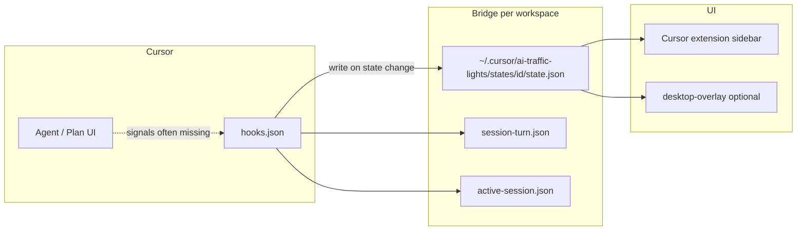

# AI Traffic Lights — Runtime Logic & Known Limits

Reference for later iteration. **Do not** rely on local `*.log` files under `.ai-traffic-lights/` (removed); use `state.json` + optional `TRAFFIC_LIGHTS_DEBUG=1` stderr from hooks.

## Architecture

| Piece | Path | Role |
|-------|------|------|
| Hook entry | `~/.cursor/ai-traffic-lights/hooks/write-bridge-from-hook.mjs` (global) or project `.cursor/hooks/` | Map Cursor events → state file |
| Path layout | [`scripts/lib/bridge-paths.mjs`](../scripts/lib/bridge-paths.mjs) | Per-workspace dir under `~/.cursor/ai-traffic-lights/states/` |
| State rules | [`scripts/lib/bridge-resolve.mjs`](../scripts/lib/bridge-resolve.mjs) | Single mapping table |
| Ask / transcript | [`scripts/lib/cursor-transcript-state.mjs`](../scripts/lib/cursor-transcript-state.mjs) | AskQuestion phase, latch |
| Plan session | [`scripts/lib/plan-session.mjs`](../scripts/lib/plan-session.mjs) | `plan.awaitingBuild`, CreatePlan, `.plan.md` |
| Optional watcher | [`tools/cursor-state-watcher.mjs`](../tools/cursor-state-watcher.mjs) | **Opt-in** `npm run bridge:watch` — not started by extension |
| Extension UI | [`products/cursor-extension/`](../products/cursor-extension/) | Reads `state.json` via file watcher |
| Overlay UI | [`products/desktop-overlay/`](../products/desktop-overlay/) | Same bridge file |

## State → lights (extension)

| State | Lights | Blink |
|-------|--------|-------|
| `RUNNING` | Red on | — |
| `DONE` | Green on | — |
| `WAITING_USER` | Yellow | 700ms (deferred — see below) |
| `WAITING_PLAN_BUILD` | Red + yellow alternate | 700ms toggle (deferred — see below) |
| `ERROR` | Red | 700ms |
| `IDLE` | All off | — |

## Hook write policy (performance)

Hooks run as **Node subprocess per event**. Minimize work:

1. **One hook command per event type** in [`hooks.json`](../.cursor/hooks.json) (no duplicate matcher + catch-all double runs).
2. **No** `afterAgentThought`, `beforeMCPExecution`, `afterMCPExecution` (high frequency, no bridge writes).
3. **Transcript read** only on: `beforeSubmitPrompt`, `preToolUse`, `postToolUse`, `afterAgentResponse`, `afterFileEdit`, `stop`, `sessionEnd`.
4. **`shouldHookWriteBridge`** skips disk write when state unchanged and event is noisy (`preToolUse` / `postToolUse` → `RUNNING` only).
5. **Extension** does not spawn watcher or poll; only `fs.watch` on `state.json`.

## Event → state (happy path)

| When | Typical state | Source |
|------|---------------|--------|
| User sends message | `RUNNING` | `beforeSubmitPrompt` |
| Tool runs | (often no write) | `preToolUse` / `postToolUse` suppressed |
| Turn ends | `DONE` | `stop` + `completed` (v4.6: always DONE, clears plan) |
| Plan pause (if ever detected) | `WAITING_PLAN_BUILD` | `stop` + `aborted` + plan context, or CreatePlan / `.plan.md` hook |
| Tool failure | `ERROR` | `postToolUseFailure` |

## Known limitations (Cursor ~3.5.x) — accepted for now

### WAITING_USER (AskQuestion / yellow)

- `preToolUse` matcher `AskQuestion` **usually does not fire** in real chats.
- Transcript `tool_use: AskQuestion` often appears **after** user submits, not when the panel opens.
- **User-visible:** stays `RUNNING` / red during Questions UI.
- **Do not** add aggressive silence heuristics (caused yellow-then-green before v4.5).
- **Dependency:** Cursor documented “waiting for user” hook or earlier transcript row.

### WAITING_PLAN_BUILD (Plan / red-yellow)

- Same class: **`plan.awaitingBuild` rarely true** in real Plan mode (`CreatePlan` hook / `stop(aborted)` often missing).
- **User-visible:** B phase stays `RUNNING` / red; manual command `AI Traffic Lights: Set Plan Waiting` proves UI works.
- v4.6: **`stop(completed)` no longer scans** `~/.cursor/plans/*.plan.md` (fixed false red-yellow after reply ends).

### DONE delay (~1s)

- Green tied to **`stop(completed)`**, not last streamed token.
- Expected; not a polling delay in extension.

## Debug (optional)

| Command | Purpose |
|---------|---------|
| `npm run debug:set:running\|waiting\|plan\|done\|error\|idle` | Force bridge state |
| `npm run bridge:watch` | Optional transcript fallback (manual) |
| `TRAFFIC_LIGHTS_DEBUG=1` | Hook stderr only |

## Version notes

| Version | Change |
|---------|--------|
| v4.5 | Removed post-`afterAgentResponse` silence yellow |
| v4.6 | `stop(completed)` → always DONE; plan scan only on `aborted` |
| v4.7 | Slim hooks.json, no extension watcher/poll, no local logs |

## Next product steps (see DEVELOPMENT_PLAN §10)

1. **Desktop overlay** — same bridge; validate floating UI (lower effort than new adapter).
2. **Codex adapter** — new signal source in `libs/adapters`; after overlay stable.
3. Revisit yellow / Plan when Cursor improves hooks.
